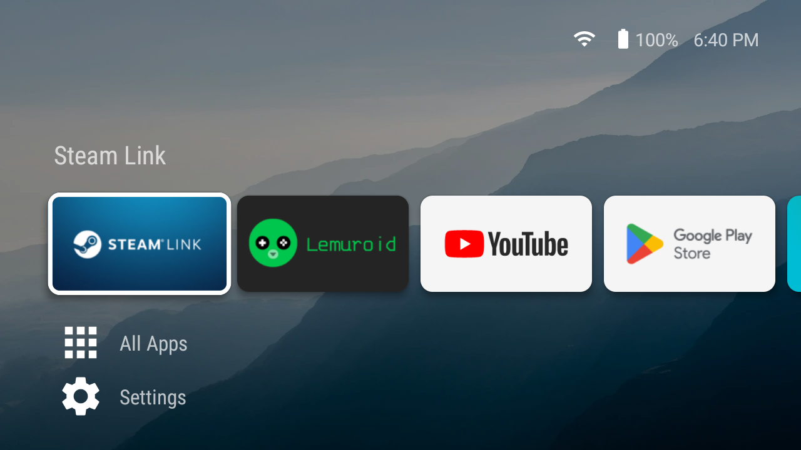
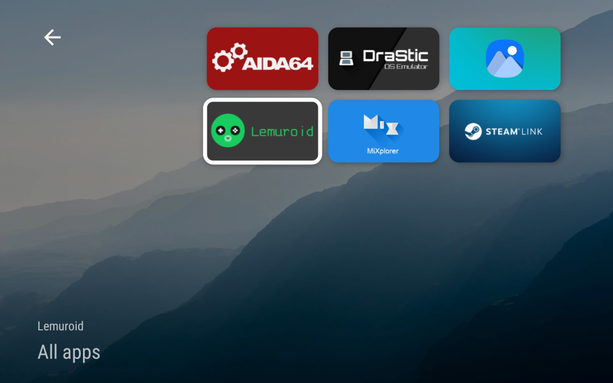
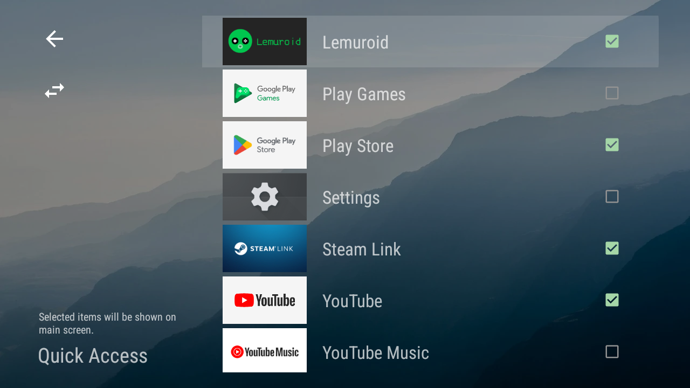

# Molla

Molla is an alternative launcher for Android.

Originally designed for handheld gaming devices, Molla features an intuitive D-pad first design, with a straightforward Android-centric experience.

## Download

or grab the APKs directly:

 

## Features

- D-pad first design: no touchscreen required
- Clutter-free interface, inspired by Android TV
- Packed with unusual niche features, including:
  - Separate wallpaper from system wallpaper
  - Closeable
  - Autostart Molla at boot
  - Launch selected app automatically at start
  - Custom shortcuts
  - and more!

## Screenshots

Wallpaper: [Mountain dew during sunrise](https://unsplash.com/photos/mountain-dew-during-sunrise-xJ2tjuUHD9M) by Paul Earle

## License

Molla is distributed under the GNU GPL v3.
